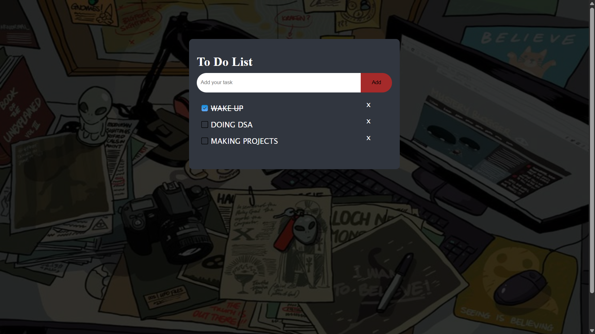

# TASK VAULT – JavaScript To-Do List App

A simple and modern **To-Do List web application** built using **HTML, CSS, and JavaScript**.
It allows users to add tasks, mark them as completed, and delete tasks easily.

This project was created to practice **DOM manipulation, event handling, and basic frontend development concepts**.

---

##  Features

* Add new tasks
* Mark tasks as completed
* Delete tasks
* Interactive UI
* Lightweight and fast
* Beginner-friendly JavaScript project
* Local storage support

---

##  Technologies Used

* **HTML5** – Structure of the app
* **CSS3** – Styling and UI design
* **JavaScript (Vanilla JS)** – Functionality and DOM manipulation

---


---

##  How It Works

1. User types a task in the input field.
2. Click **Add** to create a new task.
3. Click a task to **mark it as completed**.
4. Click the **× button** to delete the task.

---

##  Preview

```

```

